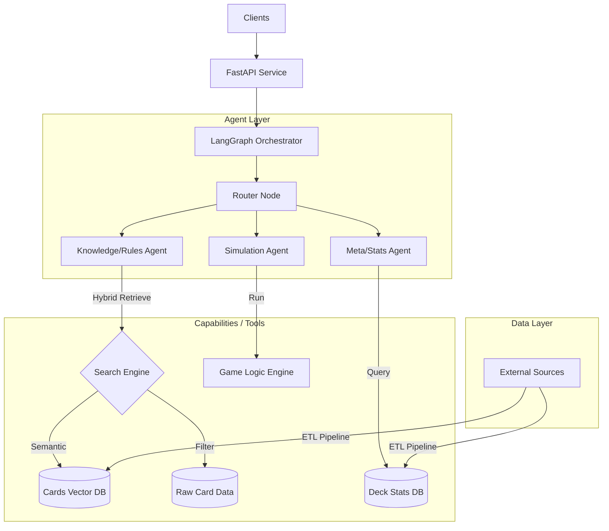

# Project Specification: OPTCG AI Service

เอกสารนี้ระบุรายละเอียดทางเทคนิคและแผนการพัฒนาสำหรับโปรเจค OPTCG AI Service ซึ่งเป็น AI Agent สำหรับวิเคราะห์และให้ข้อมูลเกี่ยวกับ One Piece Card Game

## 1. Project Overview (ภาพรวมโครงการ)
**Goal:** สร้าง AI Service ที่สามารถตอบคำถาม, วิเคราะห์ข้อมูล Deck, และจำลองสถานการณ์การเล่น (Simulation) ของ One Piece Card Game ได้ โดยใช้เทคโนโลยี AI Agent
**Purpose:** เพื่อเป็นโปรเจคศึกษา (Educational Project) ด้านการพัฒนา AI Agent, Multi-Agent Systems และการนำ LLM มาประยุกต์ใช้ในการวิเคราะห์เกม

## 2. Requirements (ความต้องการระบบ)

### Functional Requirements
1.  **Card Knowledge Analysis:** เข้าใจข้อมูลการ์ด Model, Effect, Trigger และ Attribute ต่างๆ
2.  **Rule Understanding:** เข้าใจกติกาพื้นฐานและ Flow ของเกม (Implemented via Vector Search on Official Rules)
3.  **Deck & Meta Analysis:**
    *   วิเคราะห์ Deck list
    *   ดูสถิติการใช้งาน (Meta trends)
    *   แนะนำ card (การ์ดแก้ทาง)
4.  **Simulation:** จำลองการต่อสู้ (Battle) ระหว่าง Deck เพื่อหา Win Rate
5.  **Competitive Gameplay AI:** (Highlight) สร้าง AI ที่สามารถเล่นเกมได้จริง มีการตัดสินใจที่ถูกต้อง (Decision Making) เพื่อเอาชนะคู่ต่อสู้ได้ ไม่ใช่แค่สุ่มเล่น

### Non-Functional Requirements
1.  **Modularity:** แยกส่วนประกอบชัดเจน (API, Agent, Engine, Data) เพื่อการดูแลรักษา
2.  **Extensibility:** รองรับฟีเจอร์ AIOps (Evaluation, Tracing) ในอนาคต
3.  **Observability:** มีระบบ Tracing/Logging เพื่อตรวจสอบกระบวนการคิดของ Agent (LangSmith/Phoenix)
4.  **Reliability:** มี Guardrails ป้องกันการทำผิดกติกา (Illegal Moves)
5.  **Simplicity:** โค้ดเข้าใจง่าย ไม่ซับซ้อนจนเกินไป เหมาะแก่การเรียนรู้

## 3. Technology Stack

*   **Language:** Python 3.10+
*   **Web Framework:** FastAPI (สำหรับสร้าง REST API)
*   **AI Framework:** LangChain / LangGraph (สำหรับทำ Agentic Workflow)
*   **LLM Model:** Google Gemini (ผ่าน Google AI Studio)
*   **Data Source:** JSON Data จาก API `https://tcgcsv.com/tcgplayer/68/{Group ID}/products`
    *   ดึงทุก Group ID แล้วกรองเฉพาะสินค้าที่เป็น **Card**
    *   เก็บแยกไฟล์ JSON ตาม Group ID
*   **Search Strategy:** **Hybrid Search** (สำคัญมาก)
    *   **Vector Search (Semantic):** ใช้ ChromaDB/FAISS สำหรับคำถามเชิงความหมาย
    *   **Structured Search (Exact):** ใช้ SQL/JSON Filtering สำหรับ Stat (Power, Cost, Type, Color)
*   **Vector Database:** ChromaDB (สำหรับ Cards and Rules Knowledge Base)
*   **Testing:** Pytest

## 4. System Architecture (สถาปัตยกรรมระบบ)

ระบบจะออกแบบเป็น **Modular Architecture**

### Module Breakdown
1.  **`app/`**: เก็บ FastAPI related files (main, routers, schemas).
2.  **`agents/`**: เก็บ Code ของ LangGraph nodes, edges และ prompts.
    *   *Knowledge Agent*: เชี่ยวชาญเรื่อง Text ของการ์ด
    *   *Stats Agent*: เชี่ยวชาญเรื่องตัวเลขและ Meta
3.  **`engine/`**: (สำคัญ) Python pure logic ที่จำลองกติกาเกม OPTCG สำหรับใช้ใน Simulation.
4.  **`data/`**: ศูนย์กลางข้อมูล
    *   **`scripts/`**: Utility Scripts (`fetch`, `clean`, `embed`, `query`).
    *   **`chroma_db_gemini/`**: Vector DB (Google GenAI).
    *   **`clean_json/`**: ข้อมูลการ์ดที่ผ่านการ Clean.
5.  **`core/`**: Config, Logger, Utilities.

### Data Retrieval Strategy (Hybrid Search)
เพื่อความแม่นยำ 100% ในบริบทของ Card Game เราจะไม่พึ่งพา Vector Search เพียงอย่างเดียว แต่จะใช้ระบบ Hybrid:
1.  **Retrieve IDs:** ใช้ Vector Search หา ID ของการ์ดที่เกี่ยวข้องจากบริบทคำถาม
2.  **Fetch Data:** ใช้ ID ดึงข้อมูลดิบ (Raw JSON) เพื่อให้ได้ค่า Text และ Stat ที่ถูกต้องแน่นอน
3.  **Generate:** ให้ AI ตอบคำถามจากข้อมูลดิบนั้น

## 5. Development Phases (แผนการพัฒนา)

แบ่งออกเป็น 4 Phase ใหญ่ๆ เพื่อให้เห็นผลลัพธ์ทีละขั้น

### Phase 1: Foundation & Knowledge Base (ระบบพื้นฐานและคลังความรู้)
*Focus: ทำให้ AI "รู้จัก" การ์ด One Piece ด้วยระบบ Hybrid Search*
*   [x] **Project Setup:** สร้าง Git, Setup `uv` และ Folder Structure
*   [x] **Data Ingestion Pipeline (Refactored):**
    *   **Architecture:** เก็บ Script ทั้งหมดไว้ที่ `data/scripts/` เพื่อความสะอาด
    *   **Workflow:**
        1.  `fetch_group_id.py`: เช็ค Set ใหม่จาก API
        2.  `fetch_cards.py`: โหลด Raw JSON
        3.  `clean_data.py`: **Data Cleaning** แปลงข้อมูลให้ Flat, Clean และกรอง Deduplication (By Card ID)
        4.  `embed_loader.py`: Index ข้อมูลที่ Clean แล้วลง Vector DB
    *   **Automation:** ใช้ `check_for_updates.py` จัดการ Flow ทั้งหมดอัตโนมัติ
*   [x] **Hybrid Search System:**
    *   **Vector Database:**
        *   แยก Folder ชัดเจนตาม Provider: `data/chroma_db_gemini` และ `data/chroma_db_huggingface`
        *   รองรับการสลับ Model ผ่าน Config (`.env`)
    *   **Search Service:**
        *   รองรับ **Dynamic k** (AI ปรับจำนวนผลลัพธ์ได้เอง)
        *   แสดงผลพร้อม **Clean ID** (e.g., OP01-001)
*   [x] **Basic Knowledge Agent:** สร้าง LangGraph Agent ที่ใช้ Search Tool ตอบคำถามได้
*   [x] **API:** สร้าง Endpoint `POST /api/chat` ด้วย FastAPI

### Phase 1.5: Containerization (Deployment Ready)
*Focus: เตรียม Environment สำหรับนำ API ไปทดสอบบน Host จริง
*   [ ] **Dockerization:**
    *   สร้าง `Dockerfile` สำหรับ Build Image ของ Service Application
    *   สร้าง `docker-compose.yml` เพื่อทดสอบการรัน Service.
    [ ] **DevOps:**
    *   จัดการ Environment Variables (`.env`) สำหรับ Production.

### Phase 2: Infrastructure & Quality Assurance Foundation
*Focus: ปูพื้นฐานระบบตรวจสอบ (Observability) และความปลอดภัย (Guardrails) ก่อนเริ่มงานยาก*
*   [ ] **Observability Setup:**
    *   Setup **LangSmith** Project.
    *   เชื่อมต่อ Tracing เข้ากับ Agent ที่มีอยู่ (Knowledge Agent).
*   [ ] **Guardrails Setup:**
    *   ติดตั้ง Library Guardrails.
    *   สร้าง Input/Output Validation เบื้องต้นสำหรับ API.

### Phase 3: Game Engine Implementation
*Focus: สร้างระบบเกม (สนามเด็กเล่น) ให้สมบูรณ์*
*   *Note: เริ่มเขียน Logic เกมจริงๆ ใน Phase นี้*
*   [ ] ออกแบบ Class/Model (Game, Player, Card, Board).
*   [ ] เขียน Game Loop (Draw, Don!!, Main, Attack, End).
*   [ ] ฝัง Tracing ลงใน Game Loop เพื่อส่งข้อมูลเข้า LangSmith.
*   [ ] ฝัง Guardrails ตรวจสอบ State ของเกมป้อนกัน Illegal Moves.

### Phase 4: Basic AI & Simulation (Validation)
*Focus: เชื่อมต่อ AI ให้เล่นจนจบเกมได้*
*   [ ] เชื่อมต่อ Agent เข้ากับ Game Engine.
*   [ ] สร้าง **Random/Rule-based Agent** เพื่อทดสอบ Loop.
*   [ ] ตรวจสอบผลการเล่นผ่าน Dashboard ของ LangSmith.

### Phase 5: Competitive AI (The Goal)
*Focus: สร้าง AI ที่เล่นเพื่อชัยชนะ*
*   [ ] พัฒนา Strategy Agent (Minimax/Search).
*   [ ] วัดผล Win Rate (Evaluation).

### Phase 6: Meta Analysis (Optional)
*Focus: วิเคราะห์สถิติ*
*   [ ] ระบบแนะนำ Deck.

## 6. Implementation Plan: Starting Point (จุดเริ่มต้น)

สิ่งแรกที่จะเริ่มทำคือ **Phase 1: Foundation & Knowledge Base**

1.  **Project Init:**
    *   Create Git Repository
    *   **uv** + `venv` Setup (Fast Python Package Installer)
2.  **Data Ingestion:**
    *   Download `cards.json`
    *   Process & Embed data to VectorDB.
3.  **LangGraph Setup:**
    *   Simple Graph: Input -> Retrieve -> Generate -> Output.
4.  **API:**
    *   POST `/chat` endpoint.

---
*Note: เป้าหมายสูงสุดของโปรเจคคือการสร้าง "Winning AI" ที่เล่นเกมได้จริง ดังนั้นการพัฒนา Game Engine ให้สมบูรณ์จึงเป็นหัวใจสำคัญ*
