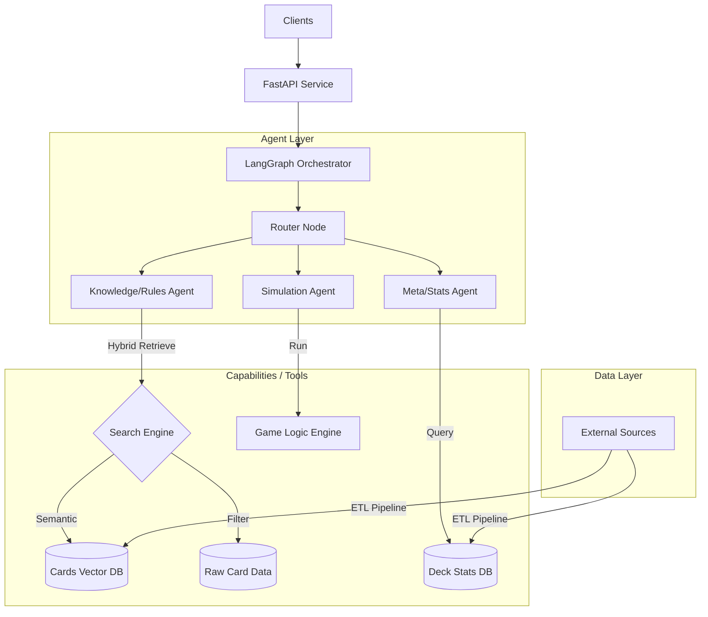

# Project Specification: OPTCG AI Service

เอกสารนี้ระบุรายละเอียดทางเทคนิคและแผนการพัฒนาสำหรับโปรเจค OPTCG AI Service ซึ่งเป็น AI Agent สำหรับวิเคราะห์และให้ข้อมูลเกี่ยวกับ One Piece Card Game

## 1. Project Overview (ภาพรวมโครงการ)
**Goal:** สร้าง AI Service ที่สามารถตอบคำถาม, วิเคราะห์ข้อมูล Deck, และจำลองสถานการณ์การเล่น (Simulation) ของ One Piece Card Game ได้ โดยใช้เทคโนโลยี AI Agent
**Purpose:** เพื่อเป็นโปรเจคศึกษา (Educational Project) ด้านการพัฒนา AI Agent, Multi-Agent Systems และการนำ LLM มาประยุกต์ใช้ในการวิเคราะห์เกม

## 2. Requirements (ความต้องการระบบ)

### Functional Requirements
1.  **Card Knowledge Analysis:** เข้าใจข้อมูลการ์ด Model, Effect, Trigger และ Attribute ต่างๆ
2.  **Rule Understanding:** เข้าใจกติกาพื้นฐานและ Flow ของเกม (Implemented via Vector Search on Official Rules)
3.  **Deck & Meta Analysis:**
    *   วิเคราะห์ Deck list
    *   ดูสถิติการใช้งาน (Meta trends)
    *   แนะนำ card (การ์ดแก้ทาง)
4.  **Simulation:** จำลองการต่อสู้ (Battle) ระหว่าง Deck เพื่อหา Win Rate

### Non-Functional Requirements
1.  **Modularity:** แยกส่วนประกอบชัดเจน (API, Agent, Engine, Data) เพื่อการดูแลรักษา
2.  **Extensibility:** รองรับฟีเจอร์ AIOps (Evaluation, Tracing) ในอนาคต
3.  **Simplicity:** โค้ดเข้าใจง่าย ไม่ซับซ้อนจนเกินไป เหมาะแก่การเรียนรู้

## 3. Technology Stack

*   **Language:** Python 3.10+
*   **Web Framework:** FastAPI (สำหรับสร้าง REST API)
*   **AI Framework:** LangChain / LangGraph (สำหรับทำ Agentic Workflow)
*   **LLM Model:** Google Gemini (ผ่าน Google AI Studio)
*   **Data Source:** JSON Data จาก API `https://tcgcsv.com/tcgplayer/68/{Group ID}/products`
    *   ดึงทุก Group ID แล้วกรองเฉพาะสินค้าที่เป็น **Card**
    *   เก็บแยกไฟล์ JSON ตาม Group ID
*   **Search Strategy:** **Hybrid Search** (สำคัญมาก)
    *   **Vector Search (Semantic):** ใช้ ChromaDB/FAISS สำหรับคำถามเชิงความหมาย
    *   **Structured Search (Exact):** ใช้ SQL/JSON Filtering สำหรับ Stat (Power, Cost, Type, Color)
*   **Vector Database:** ChromaDB (สำหรับ Cards and Rules Knowledge Base)
*   **Testing:** Pytest

## 4. System Architecture (สถาปัตยกรรมระบบ)

ระบบจะออกแบบเป็น **Modular Architecture**

### Module Breakdown
1.  **`app/`**: เก็บ FastAPI related files (main, routers, schemas).
2.  **`agents/`**: เก็บ Code ของ LangGraph nodes, edges และ prompts.
    *   *Knowledge Agent*: เชี่ยวชาญเรื่อง Text ของการ์ด
    *   *Stats Agent*: เชี่ยวชาญเรื่องตัวเลขและ Meta
3.  **`engine/`**: (สำคัญ) Python pure logic ที่จำลองกติกาเกม OPTCG สำหรับใช้ใน Simulation.
4.  **`data/`**: Script สำหรับ Load data, Vector DB management.
4.  **`data/`**: Script สำหรับ Load data, Vector DB management.
5.  **`core/`**: Config, Logger, Utilities.

### Data Retrieval Strategy (Hybrid Search)
เพื่อความแม่นยำ 100% ในบริบทของ Card Game เราจะไม่พึ่งพา Vector Search เพียงอย่างเดียว แต่จะใช้ระบบ Hybrid:
1.  **Retrieve IDs:** ใช้ Vector Search หา ID ของการ์ดที่เกี่ยวข้องจากบริบทคำถาม
2.  **Fetch Data:** ใช้ ID ดึงข้อมูลดิบ (Raw JSON) เพื่อให้ได้ค่า Text และ Stat ที่ถูกต้องแน่นอน
3.  **Generate:** ให้ AI ตอบคำถามจากข้อมูลดิบนั้น

## 5. Development Phases (แผนการพัฒนา)

แบ่งออกเป็น 4 Phase ใหญ่ๆ เพื่อให้เห็นผลลัพธ์ทีละขั้น

### Phase 1: Foundation & Knowledge Base (ระบบพื้นฐานและคลังความรู้)
*Focus: ทำให้ AI "รู้จัก" การ์ด One Piece ด้วยระบบ Hybrid Search*
*   [x] **Project Setup:** สร้าง Git, Setup `uv` และ Folder Structure
*   [x] **Data Ingestion:**
    *   เขียน Script Loop ดึง API `/products` ของทุก Group ID
    *   Filter เก็บเฉพาะ **Cards** (ตัด Sealed Product ออก)
    *   Save เป็น JSON ไฟล์ละ 1 Group (`cards_{group_id}.json`)
    *   **Data Cleaning & Deduplication:**
        *   กรองการ์ดที่ซ้ำกันออกโดยเช็คจาก Card Number (เช่น OP01-001) เก็บเฉพาะใบแรกที่พบเพื่อลดความซ้ำซ้อนใน DB
        *   optimize เพิ่มเติม
*   [x] **Hybrid Search System:**
    *   Setup ChromaDB (Vector Search)
    *   Implement Structured Search (Filter จาก JSON)
    *   รวมระบบค้นหา (Retrieve Logic)
*   [x] **Basic Knowledge Agent:** สร้าง LangGraph Agent ที่ใช้ Search Tool ได้
    *   *Added:* **Rule Search Tool** (ค้นหากติกาจาก Official Rules)
    *   **Flexible Embedding Provider (Refactored):**
        *   รองรับการสลับ Model ระหว่าง `Google Gemini` (API) และ `HuggingFace` (Local) ผ่าน Config `.env`
        *   แยก Vector DB Path ตาม Provider เพื่อป้องกันความขัดแย้งของข้อมูล (`data/chroma_db_gemini` vs `data/chroma_db_huggingface`)
        *   Centralized Provider Logic ที่ `data/embedding_provider.py`
*   [x] **API:** สร้าง Endpoint `POST /api/chat` ด้วย FastAPI

### Phase 1.5: Containerization (Deployment Ready)
*Focus: เตรียม Environment สำหรับนำ API ไปทดสอบบน Host จริง*
*   [ ] **Dockerization:**
    *   สร้าง `Dockerfile` สำหรับ Build Image ของ Service Application (Optimized Size)
    *   สร้าง `docker-compose.yml` เพื่อทดสอบการรัน Service และ Database ในสภาพแวดล้อมจำลอง
*   [ ] **Configuration Management:**
    *   จัดการ Environment Variables ผ่าน `.env` สำหรับ Production
*   [ ] **Host Testing:**
    *   ทดสอบเรียกใช้งาน API ผ่าน Container เพื่อจำลองการใช้งานจริง

### Phase 2: Rules Engine, Simulation & Evaluation
*Focus: ทำให้ AI "เล่น" เป็น และ "ตรวจสอบ" ความถูกต้องได้*
*   [ ] ออกแบบ Class/Model ของเกม (Game, Player, Card, Board, Phase).
*   [ ] เขียน Game Loop พื้นฐาน (Draw, Don!!, Main, Attack, End).
*   [ ] Implement กติกาการเล่นพื้นฐาน.
*   [ ] สร้าง **Simulator Module** ที่รับ Deck List 2 ฝั่งแล้วรันเกมจนจบ (อาจจะเป็น Random Action ไปก่อนในช่วงแรก).
*   [ ] เพิ่ม **LangSmith** หรือ **Phoenix** สำหรับ Tracing/Monitoring เพื่อตรวจสอบการทำงานของ Agent.
*   [ ] ทำ **Evaluation set** (ชุดทดสอบ) เพื่อวัดผลความถูกต้องของคำตอบและ Logic อย่างสม่ำเสมอ.

### Phase 3: Meta Analysis & Agent Intelligence
*Focus: ทำให้ AI "วิเคราะห์" และ "แนะนำ" ได้*
*   [ ] เชื่อมข้อมูล Deck Stats (อาจจะต้องหา Mock data หรือแหล่งข้อมูลเสริม).
*   [ ] สร้าง **Meta Agent** ที่ดึงข้อมูลสถิติได้.
*   [ ] สร้าง Logic การแนะนำการ์ด (Deck Suggestion) โดยดูจาก Win Rate หรือ Card usage.
*   [ ] พัฒนา **Stats Agent** ให้ทำงานร่วมกับ Simulator (เช่น รัน Sim 100 รอบแล้วสรุปผล).

### Phase 4: Advanced Features (Future)
*Focus: ปรับปรุงคุณภาพและระบบให้ฉลาดขึ้น*
*   [ ] เพิ่ม Guardrails ป้องกัน AI ตอบนอกเรื่อง.
*   [ ] Refactor Simulation ให้ฉลาดขึ้น (ใช้ Search Algorithm หรือ RL แทน Random).

## 6. Implementation Plan: Starting Point (จุดเริ่มต้น)

สิ่งแรกที่จะเริ่มทำคือ **Phase 1: Foundation & Knowledge Base**

1.  **Project Init:**
    *   Create Git Repository
    *   **uv** + `venv` Setup (Fast Python Package Installer)
2.  **Data Ingestion:**
    *   Download `cards.json`
    *   Process & Embed data to VectorDB.
3.  **LangGraph Setup:**
    *   Simple Graph: Input -> Retrieve -> Generate -> Output.
4.  **API:**
    *   POST `/chat` endpoint.

---
*Note: โปรเจคนี้เน้นความเข้าใจใน Architecture ของ Agent ถ้าส่วน Game Simulation ซับซ้อนเกินไป อาจจะลด Scope เหลือแค่การคำนวณ Probability เบื้องต้นจากการ์ดบนมือแทนการเล่นจนจบเกม*
